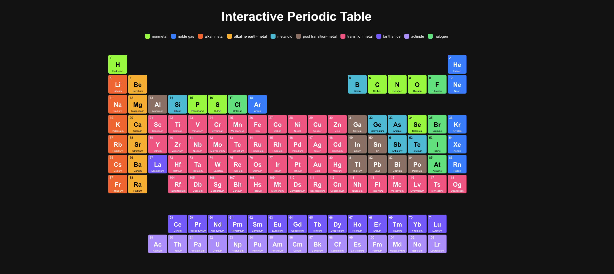

# Interactive Periodic Table



This project is an interactive periodic table built with Next.js and p5.js. It allows users to explore all 118 elements of the periodic table with detailed information and visualizations of atomic structures.

## Live Demo

Check out the live application: [Interactive Periodic Table](https://nextjs-periodic-table.vercel.app/)

## Features

- Complete periodic table with all 118 elements
- Color-coded element categories
- Interactive element selection
- Detailed element information including:
  - Physical and chemical properties
  - Electron configuration
  - Discovery information
  - Description and uses
- Dynamic atomic structure visualization using p5.js
  - Shows electron shells and distribution
  - Animated electron movement
  - Scales appropriately for elements with many electrons

## Getting Started

### Prerequisites

- Node.js 16.8.0 or later
- npm, yarn, or pnpm

### Installation

1. Install dependencies:
```bash
npm install
# or
yarn install
# or
pnpm install
```

2. Run the development server:
```bash
npm run dev
# or
yarn dev
# or
pnpm dev
``` 

3. Open [http://localhost:3000](http://localhost:3000) with your browser to see the application.

## How to Use

- **View Element Details**: Click on any element in the periodic table to display detailed information and its atomic structure.
- **Hover for Quick Info**: Hover over elements to see a quick tooltip with basic information.
- **Explore Atomic Structure**: The atomic structure visualization shows the nucleus and electron shells with the correct number of electrons in each shell.

## Technologies Used

- [Next.js](https://nextjs.org/) - React framework
- [p5.js](https://p5js.org/) - JavaScript library for creative coding
- [TypeScript](https://www.typescriptlang.org/) - Typed JavaScript
- CSS Modules - For component-scoped styling

## Project Structure

- `src/app` - Next.js app router components
- `src/components` - React components
  - `AtomicStructure.tsx` - p5.js visualization of atomic structure
  - `ElementCell.tsx` - Individual element cell in the periodic table
  - `ElementDetail.tsx` - Detailed element information display
  - `PeriodicTable.tsx` - Main periodic table component
- `src/data` - Data files
  - `periodicTableData.ts` - Complete data for all 118 elements
- `src/types` - TypeScript type definitions

## License

This project is licensed under the MIT License - see the LICENSE file for details.

## Acknowledgments

- Data sourced from various scientific references
- Inspired by educational periodic table visualizations
